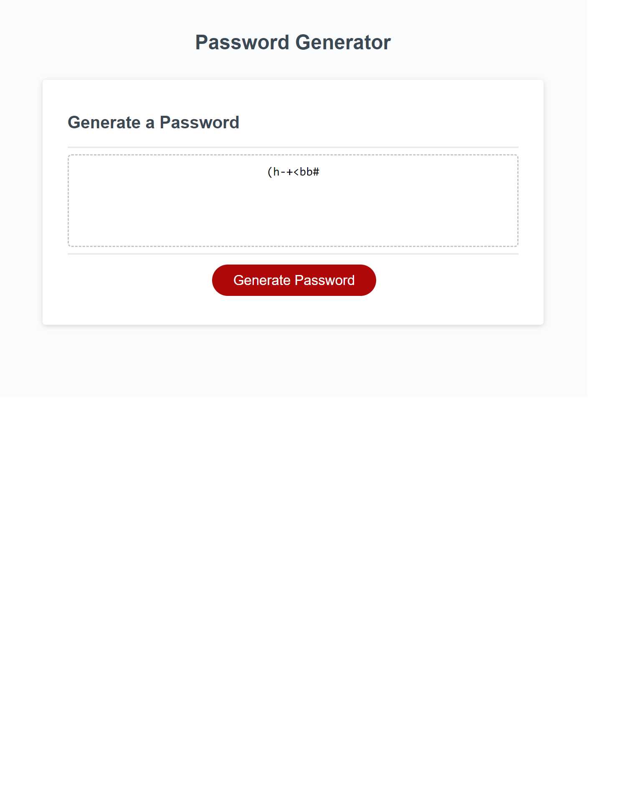

# 03 JavaScript: Password Generator

## Create a random Password generator

* Have user input length of desired password between 8 and 128 characters
* Ask user which of the following they want included in the password
* * Numbers
* * Special characters
* * Upper case letters
* * Lower case letters
* Make sure at least one character of the desired choices is included

## Screenshot

## Deployed Page

https://napoleondd86.github.io/password-generator/
